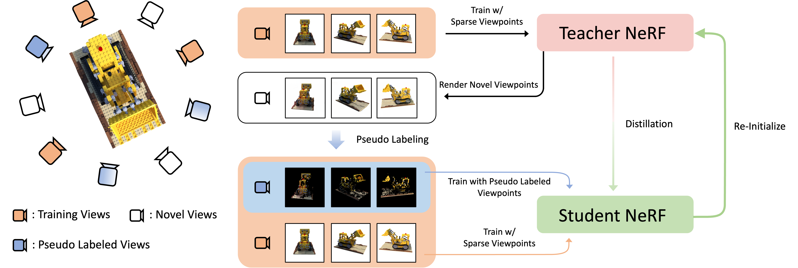

# SE-NeRF : Self-Evolving Neural Radiance Fields
<a href="https://arxiv.org/abs/2312.01003"></a>
<a href="https://ku-cvlab.github.io/SE-NeRF/ "></a>
<br>

This is our official implementation of Self-Evolving Neural Radiance Fields!

by [Jaewoo Jung](https://github.com/crepejung00)\*, [Jisang Han](https://github.com/ONground-Korea)\*, [Jiwon Kang](https://github.com/loggerJK)\*, [Seongchan Kim](https://github.com/deep-overflow), [Min-seop Kwak](https://mskwak01.github.io/), [Seungryong Kim](https://cvlab.korea.ac.kr)&dagger;

## Updates
### &#9888; Please notice that the code is currently being refactored, so minor bugs or mismatches with the metrics in the original paper might exist. Please feel free to raise any issues and we will fix it as soon as possible!

2024/02 : We released our codes for <b>SE-NeRF(K-Planes)</b> on the NeRF Synthetic & NeRF Synthetic Extreme dataset!

## Introduction

We introduce a self-training framework applicable to existing Neural Radiance Fields!  

We show that the self-training strategy successfully mitigates the overfitting problem when training NeRFs with only sparse inputs.

For further details and visualization results, please check out our [paper](https://arxiv.org/abs/2312.01003) and our [project page](https://ku-cvlab.github.io/SE-NeRF/).

## Installation
Please follow [installation](INSTALL.md). 

## Datasets
Training and evaluation data can be downloaded from the respective websites.

NeRF Synthetic Dataset(blender) : [Data](https://www.matthewtancik.com/nerf).

## Training

Currently only [K-Planes](https://github.com/sarafridov/K-Planes) is the supported backbone model!

To train the model with our framework, all you need to do is:

```
python train.py --backbone kplanes
```


## Acknowledgement
As we show that our framework succesfully applies self-training to existing NeRF models, we utilized the public codes for the baseline networks in this repository.

We would like to acknowledge the contributions of [K-Planes](https://github.com/sarafridov/K-Planes) for open-sourcing the official codes for K-Planes! 

## Citation

```
@misc{jung2023selfevolving,
      title={Self-Evolving Neural Radiance Fields}, 
      author={Jaewoo Jung and Jisang Han and Jiwon Kang and Seongchan Kim and Min-Seop Kwak and Seungryong Kim},
      year={2023},
      eprint={2312.01003},
      archivePrefix={arXiv},
      primaryClass={cs.CV}
}
```
